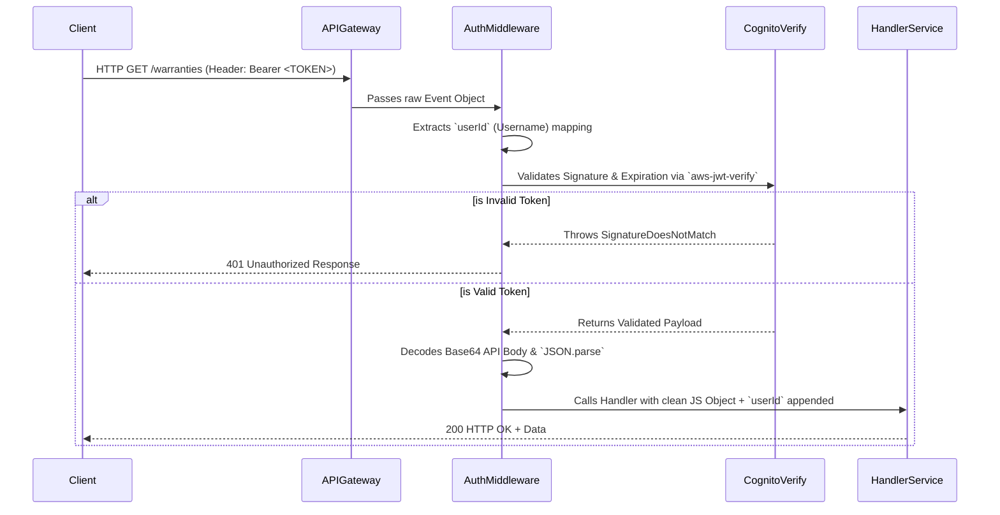

# Warrantor Backend

Enterprise-grade serverless warranty management API built on AWS. Infinite scalability, zero idle costs, millisecond latency.

<div align="center">

[](https://serverless.com)
[](https://aws.amazon.com/)
[](https://nodejs.org/)
[](https://aws.amazon.com/dynamodb/)

[Documentation](#overview) · [Quick Start](#quick-start) · [Architecture](#system-architecture) · [API Reference](#api-reference)

</div>

---

## Overview

A fully serverless backend for warranty management built on AWS Lambda, DynamoDB, and Cognito. Designed for enterprise scalability with zero idle costs and automatic infrastructure management.

### Key Capabilities

- **Serverless Compute** — AWS Lambda with automatic scaling and pay-per-invocation pricing
- **Enterprise Authentication** — JWT-based native authorizers via AWS Cognito
- **High-Performance Database** — DynamoDB with Global Secondary Indexes and sub-millisecond latency
- **Automated Lifecycle** — Amazon EventBridge Scheduler + SES for precision email alerts
- **Cascading Integrity** — Automated cleanup of schedules and notifications on warranty update/delete
- **Dynamic Notifications** — Dual-source engine merging real-time "Expires Soon" queries with historical logs
- **Clean Architecture** — 4-tier separation: Handlers (Routing), Services (Logic), Libs (SDKs), Utils (Shared)
- **Infrastructure as Code** — Full CloudFormation orchestration via Serverless Framework

---

## System Architecture

The backend uses a completely serverless infrastructure orchestrated by the Serverless Framework. All components are managed, on-demand AWS services with automatic scaling and pay-per-use pricing.


## System Architecture


### Infrastructure Principles

- **Zero Idle Costs** — Billing is 100% proportional to user traffic
- **Automatic Scaling** — Lambda manages concurrency; DynamoDB handles throughput peaks
- **Least Privilege** — IAM Policies restrict functions to specific table rows and S3 prefixes
- **Native Auth** — Offloads JWT validation to AWS API Gateway for sub-10ms overhead

---

## Automation & Lifecycle

The backend implements a complex notification lifecycle to ensure users never miss a warranty expiration.

### Precision Triggering
When a warranty is created or updated, [scheduler.js](file:///Users/abdulahad/Desktop/business/career/untitled%20folder/backend/src/services/scheduler.js) creates **two distinct one-time schedules**:
1.  **7-Day Reminder**: Triggered exactly 168 hours before the `expiryDate`.
2.  **Expiry Alert**: Triggered at midnight on the `expiryDate`.

### Cascading Integrity
To prevent "ghost" notifications, the [warrantyService.js](file:///Users/abdulahad/Desktop/business/career/untitled%20folder/backend/src/services/warranties.js) implements automated cleanup:
- **On Update**: Old schedules are purged and recalculated based on the new `expiryDate`.
- **On Delete**: All pending schedules and historical notifications are permanently deleted.

### Dynamic Notification Engine
The [notificationService.js](file:///Users/abdulahad/Desktop/business/career/untitled%20folder/backend/src/services/notifications.js) uses a **dual-source architecture**:
1.  **Historical Feed**: Fetches events logged to the `notifications` table by the Dispatcher.
2.  **Virtual Feed**: Performs a real-time scan of the `warranties` table for items expiring within 60 days.
3.  **Deduplicated Merge**: Combines both sources, sorting by timestamp for a seamless user experience.

---

## Technology Stack

### Compute & Routing
**AWS Lambda + HTTP API Gateway (v2)** — Fast, low-latency entry points. API Gateway offloads TLS termination and JWT validation, keeping Lambda warm-starts lean.

### Identity & Access
**Amazon Cognito + Native JWT** — Users are mapped via the `sub` claim. The `authMiddleware` Extracts user identity and handles automatic Base64 decoding for application/json payloads.

### NoSQL State
**Amazon DynamoDB** — Single-table architecture patterns. Uses Partition Keys (`userId`) and Sort Keys (`id`) for efficient multi-tenant isolation. Includes indexed attributes for rapid notification fetching.

### Lifecycle Hub
**EventBridge Scheduler + SES** — One-time triggers provide precision without the cost of a persistent crontab. Amazon SES is configured with production-grade DKIM/SPF identities for maximum deliverability.

### Storage Layers
**Amazon S3 + Presigned Flow** — Clients receive a temporary `PUT` URL. Images follow the naming convention: `warranties/{userId}/{fileId}.jpg` to ensure isolation at the bucket level.

### Infrastructure & Bundling
**Serverless v4 + esbuild** — Fully defined in `serverless.yml`. esbuild performs tree-shaking on `@aws-sdk` clients, reducing cold starts by stripping unused service logic.

---

## Authentication Flow

Every API request follows the same authentication pipeline:



**Key Detail** — The middleware attaches `event.userId` (the Cognito user's unique ID) to every request. Handlers trust this value because the middleware verified it cryptographically.

---

## Data Model

### Warranties Table
```
Primary Key: id (UUID)
Partition Key: id
(Multi-tenancy enforced via userId check on every request)

Fields:
├─ id (UUID, HASH)
├─ userId (Cognito sub ID)
├─ productName (String)
├─ brand (String)
├─ category (String)
├─ warrantyProvider (String)
├─ purchaseDate (ISO 8601 Date)
├─ expiryDate (ISO 8601 Date)
├─ coverageDetails (String)
├─ pictureUrl (S3 Bucket URI)

Indexes:
└─ userId-index (Allows fetching all warranties for a specific user)
```

### Notifications Table
```
Primary Key: id (UUID)
Partition Key: id

Fields:
├─ id (UUID, HASH)
├─ userId (Cognito sub ID)
├─ warrantyId (Foreign reference)
├─ productName (String)
├─ message (Email Subject / Alert Text)
├─ type (EXPIRY_NOTICE | EXPIRY_WARNING | EXPIRED)
├─ read (boolean - defaults to false)
├─ createdAt (ISO 8601 Timestamp)
├─ expiresAt (ISO 8601 Date)

Indexes:
└─ userId-createdAt-index (Allows querying history sorted by time)
```

### Settings Table
```
Primary Key: userId (Cognito ID)
(Direct access via userId)

Fields:
├─ userId (Cognito sub ID)
├─ language (e.g., en-US)
├─ notificationsEnabled (boolean)
```

---

## API Reference

### Create Warranty

```http
POST /warranties
Authorization: Bearer <token>
Content-Type: application/json

{
  "productName": "MacBook Pro 16\"",
  "brand": "Apple",
  "category": "Electronics",
  "warrantyProvider": "AppleCare",
  "purchaseDate": "2024-01-15",
  "expiryDate": "2025-01-15",
  "coverageDetails": "Accidental damage protection included",
  "pictureUrl": "https://s3.amazonaws.com/warrantor-uploads-dev-123456/warranties/user-id/file-id.jpg"
}
```

**Validation Requirements**
- `productName` (String, required)
- `brand` (String, required)
- `category` (String, required)
- `warrantyProvider` (String, required)
- `purchaseDate` (ISO Date, required)
- `expiryDate` (ISO Date, required)
- `coverageDetails` (String, required)
- `pictureUrl` (S3 URL, required)

**Background Operations**
1.  Schedules two precision triggers in **EventBridge Scheduler**.
2.  Automated cleanup of any previous schedules for the same ID (if updating).

### List Warranties

```http
GET /warranties
Authorization: Bearer <token>
```

**Response (200 OK)**
```json
{
  "warranties": [
    {
      "id": "f7ab2c9d-12ab-4c3e-8d9e-1234abcd5678",
      "productName": "MacBook Pro 16\"",
      "brand": "Apple",
      "category": "Electronics",
      "warrantyProvider": "AppleCare",
      "purchaseDate": "2024-01-15",
      "expiryDate": "2025-01-15",
      "coverageDetails": "Accidental damage protection included",
      "pictureUrl": "https://s3.amazonaws.com/..."
    }
  ],
  "count": 1
}
```

### Update Warranty

```http
PUT /warranties/{id}
Authorization: Bearer <token>
Content-Type: application/json

{
  "productName": "MacBook Pro 16\" M3 Max"
}
```

Only provided fields are updated. Other fields remain unchanged.

**Response (200 OK)**
```json
{
  "message": "Warranty updated successfully"
}
```

### Delete Warranty

```http
DELETE /warranties/{id}
Authorization: Bearer <token>
```

**Response (200 OK)**
```json
{
  "message": "Warranty deleted successfully"
}
```

### Get Notifications

```http
GET /notifications
Authorization: Bearer <token>
```

**Response (200 OK)**
```json
{
  "notifications": [
    {
      "id": "eec9ad-456b",
      "warrantyId": "f7ab2c9d-12ab-4c3e-8d9e-1234abcd5678",
      "productName": "MacBook Pro 16\"",
      "type": "EXPIRY_WARNING",
      "title": "EXPIRY WARNING",
      "message": "Your MacBook Pro 16\" warranty expires in 7 days.",
      "read": false,
      "createdAt": "2026-04-05T10:00:00Z",
      "expiresAt": "2026-04-12T00:00:00Z"
    }
  ],
  "unreadCount": 1
}
```

**Note on Types**:
- `EXPIRY_WARNING`: Scheduled alert sent 7 days before.
- `EXPIRY_NOTICE`: Direct log from the Dispatcher.
- `EXPIRED`: Computed live for items with `daysLeft <= 0`.

### Get Settings

```http
GET /settings
Authorization: Bearer <token>
```

**Response (200 OK)**
```json
{
  "email": "user@example.com",
  "name": "John Doe",
  "language": "en-US",
  "notificationsEnabled": true
}
```

Email and name come from Cognito. Language and notification preference come from the Settings table.

### Update Settings

```http
PUT /settings
Authorization: Bearer <token>
Content-Type: application/json

{
  "name": "Jane Doe",
  "language": "es-ES",
  "notificationsEnabled": false,
  "newPassword": "SecureNewPassword123!"
}
```

- `name` — Updates Cognito user attribute
- `newPassword` — Updates Cognito password (permanent)
- `language`, `notificationsEnabled` — Updates Settings table

**Response (200 OK)**
```json
{
  "message": "Settings updated successfully"
}
```

### Get S3 Upload URL

```http
GET /uploads
Authorization: Bearer <token>
```

**Response (200 OK)**
```json
{
  "uploadUrl": "https://warrantor-uploads-dev-123456.s3.amazonaws.com/warranties/user-123/file-id.jpg?X-Amz-Algorithm=AWS4-HMAC-SHA256&X-Amz-Credential=...",
  "pictureUrl": "https://warrantor-uploads-dev-123456.s3.amazonaws.com/warranties/user-123/file-id.jpg",
  "fileId": "abc123-def4-ghi5"
}
```

The `uploadUrl` is valid for 1 hour. Use it to upload the image directly to S3.

**Upload to S3**
```http
PUT <uploadUrl>
Content-Type: image/jpeg

[Binary image data]
```

No authorization header needed — the presigned URL includes temporary credentials.

After upload succeeds (200 OK), use the `pictureUrl` when creating or updating a warranty.

---

## Project Structure

```
warrantor-backend/
│
├── src/
│   ├── functions/                 # API handlers (routing layer)
│   │   ├── warranties/
│   │   │   ├── create.js          # POST /warranties
│   │   │   ├── get.js             # GET /warranties
│   │   │   ├── update.js          # PUT /warranties/{id}
│   │   │   ├── remove.js          # DELETE /warranties/{id}
│   │   │   └── getUploadUrl.js    # GET /uploads
│   │   ├── notifications/
│   │   │   ├── get.js             # GET /notifications
│   │   │   └── dispatch.js        # EventBridge Trigger -> SES Email
│   │   └── settings/
│   │       ├── get.js             # GET /settings
│   │       └── update.js          # PUT /settings
│   │
│   ├── services/                  # Business logic (pure functions)
│   │   ├── warranties.js
│   │   ├── notifications.js
│   │   ├── scheduler.js           # EventBridge scheduling logic
│   │   ├── settings.js
│   │   └── uploads.js
│   │
│   ├── libs/                       # AWS SDK clients (initialized once)
│   │   ├── aws.js                  # Shared AWS SDK v3 clients
│   │   └── email.js                # SES wrapper
│   │
│   ├── middleware/                 # Auth & validation
│   │   └── auth.js                 # JWT verification
│   │
│   └── utils/                      # Formatting helpers
│       └── response.js             # HTTP response wrapper
│
├── serverless.yml                  # Infrastructure definition
├── .env.example                    # Environment template
├── package.json
└── README.md
```

### 4-Tier Architecture Pattern

This structure separates concerns to improve testability and maintainability:

1. **Functions (handlers)** — Pure routing. Accept event, call service, return formatted response.
2. **Services (business logic)** — Core logic independent of AWS. Database reads/writes, computations.
3. **Libs (AWS clients)** — SDK initialization happens once and is reused across invocations, saving cold-start time.
4. **Utils (helpers)** — Shared formatting and response builders.

---

## Quick Start

### Prerequisites

- Node.js v20 or higher
- AWS account with credentials configured (`~/.aws/credentials`)
- Serverless Framework installed globally: `npm install -g serverless`

### Installation

```bash
git clone https://github.com/yourusername/warrantor-backend.git
cd warrantor-backend
npm install
```

### Configuration

Create `.env` file:
```bash
cp .env.example .env
```

Fill in your AWS Cognito details from the AWS Console:
```env
COGNITO_USER_POOL_ID=us-east-1_XXXXXXXXX
COGNITO_CLIENT_ID=abcdef1234567890
SES_DOMAIN=yourdomain.com
SCHEDULER_ROLE_ARN=arn:aws:iam::XXXX:role/warrantor-scheduler-role-dev
```

### AWS Setup Verification

1.  **SES Domain**: Ensure the domain in `SES_DOMAIN` is **Verified** in the AWS SES Console.
2.  **Scheduler Role**: The `SCHEDULER_ROLE_ARN` must have the `lambda:InvokeFunction` permission for your backend functions.
3.  **Cognito**: Create a User Pool and App Client. Ensure `AllowAdminCreateUserOnly` is disabled if you want public signups.

### Deployment

Deploy to AWS:
```bash
serverless deploy
```

Output:
```
✓ Service deployed to stack warrantor-backend-dev
✓ Endpoint: https://abc123def.execute-api.us-east-1.amazonaws.com
```

The Serverless Framework automatically:
- Bundles code with esbuild
- Creates DynamoDB tables
- Provisions Lambda functions
- Sets up API Gateway routes
- Configures S3 bucket
- Applies IAM permissions

### Testing

Get a Cognito access token:
```bash
aws cognito-idp admin-initiate-auth \
  --user-pool-id us-east-1_XXXXXXXXX \
  --client-id abcdef1234567890 \
  --auth-flow ADMIN_NO_SRP_AUTH \
  --auth-parameters USERNAME=user@example.com,PASSWORD=YourPassword123
```

Test an endpoint with cURL:
```bash
curl -X GET https://abc123def.execute-api.us-east-1.amazonaws.com/warranties \
  -H "Authorization: Bearer eyJhbGc..."
```

Or use Postman:
1. Import the API Gateway endpoint
2. Add `Authorization` header with Bearer token
3. Create, read, update, delete warranties

---

## Security

### Authentication Architecture

The backend uses a hybrid authentication model:
1.  **Transport Security (TLS 1.3)** — All requests must use HTTPS.
2.  **API Gateway Authorizer** — Validates JWT signatures via the `JWKS_URI` from Cognito.
3.  **Application Middleware** — The [auth.js](file:///Users/abdulahad/Desktop/business/career/untitled%20folder/backend/src/middleware/auth.js) wrapper:
    - Extracts the `sub` claim from the Cognito JWT.
    - Attaches `event.userId` for service-layer consumption.
    - Decodes incoming Base64 bodies (standard for some API Gateway integrations).
    - Parses JSON payloads and handles syntax errors.

### Zero-Trust Authorization

Every database command uses a `ConditionExpression` to ensure cross-user data isolation:

```javascript
// From src/services/warranties.js
ConditionExpression: "userId = :userId"
```

This ensures that even if a user guesses another user's `warrantyId`, the AWS SDK will reject the operation at the database level because the `userId` claim (extracted from the cryptographically verified JWT) will not match.

### IAM Permissions

Lambda execution role has minimal required permissions:
- DynamoDB: Only `PutItem`, `Query`, `GetItem`, `UpdateItem`, `DeleteItem`
- Cognito: Only `AdminGetUser`, `AdminUpdateUserAttributes`, `AdminSetUserPassword`
- S3: Only `PutObject` (presigned URLs, not direct access)

No permission for `DescribeTable`, `CreateTable`, `DeleteTable`, or cross-account access.

### Data Encryption

- S3: Server-side encryption (SSE-S3) enabled by default
- DynamoDB: Encryption at rest via AWS-managed keys
- Transit: All requests use HTTPS

---

## Cost Analysis

Estimated monthly costs for 1,000 active users:

| Service | Usage | Cost |
|---------|-------|------|
| Lambda | 10M invocations @ 1s average | $2.00 |
| DynamoDB | 100K reads, 50K writes | $0.50 |
| S3 | 100GB storage + 1GB transfer | $2.50 |
| Cognito | 1,000 MAU (free tier included) | $0.00 |
| Bedrock | 1M tokens/month | $0.20 |
| SES | 10,000 emails/month | $1.00 |
| Scheduler | 20,000 triggers/month | $0.20 |
| **Total** | | **$7.40/month** |

Compare to traditional infrastructure:
- EC2 + RDS + LoadBalancer: $500–1,000/month minimum
- This serverless solution: ~99% cheaper at scale

---

## Deployment & Management

### Stage-Specific Deployments

Deploy to different environments:
```bash
serverless deploy --stage dev
serverless deploy --stage staging
serverless deploy --stage prod
```

Each stage gets its own Lambda functions, DynamoDB tables, and API Gateway endpoint.

### View Logs

Stream logs from a specific function:
```bash
serverless logs -f createWarranty --tail
serverless logs -f getNotifications --tail
```

### Remove Everything

Tear down the entire stack:
```bash
serverless remove --stage dev
```

This deletes Lambda functions, API Gateway, DynamoDB tables, and S3 buckets.

### Local Testing

Install the offline plugin for local testing:
```bash
npm install --save-dev serverless-offline
sls offline start
```

Then test against `http://localhost:3000` instead of AWS.

---

## Contributing

Contributions are welcome. Please:

1. Fork the repository
2. Create a feature branch: `git checkout -b feature/your-feature`
3. Commit changes: `git commit -m 'Add your feature'`
4. Push to branch: `git push origin feature/your-feature`
5. Open a Pull Request

---

## License

MIT © 2026 Warrantor

---

## Support

- [Serverless Framework Documentation](https://www.serverless.com/framework/docs)
- [AWS Lambda Best Practices](https://docs.aws.amazon.com/lambda/latest/dg/best-practices.html)
- [DynamoDB Design Patterns](https://docs.aws.amazon.com/amazondynamodb/latest/developerguide/best-practices.html)

---

**Built with AWS Serverless Technologies**