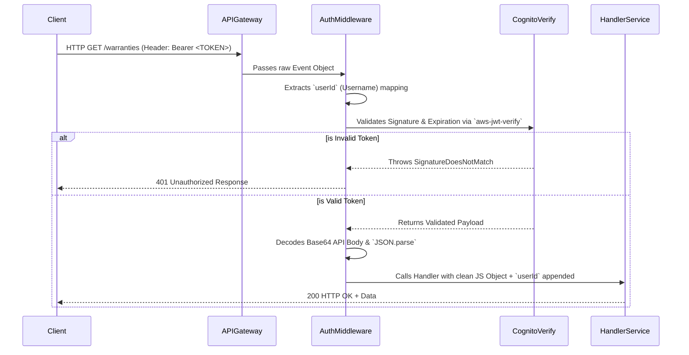
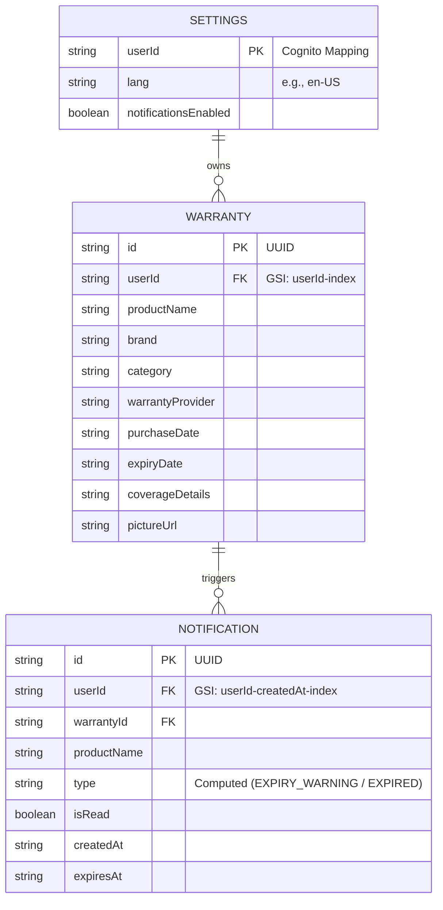
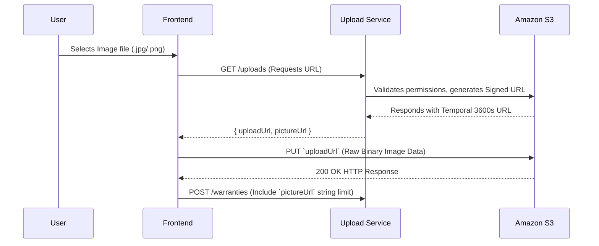

# 🛡️ Warrantor - AWS Serverless Backend

> A completely serverless, highly-scalable, and deeply-secure enterprise backend infrastructure built on the AWS Cloud. Designed from the ground up for the Warrantor Application to handle thousands of concurrent operations with single-digit millisecond latency via AWS Serverless architectures.

[](https://serverless.com)
[](https://aws.amazon.com/)
[](https://nodejs.org/en/)

---

## 📑 Table of Contents
1. [Architecture Overview](#-architecture-overview)
2. [Core Technologies](#-core-technologies)
3. [The 4-Tier Abstraction Pattern](#-the-4-tier-abstraction-pattern)
4. [Security & Authentication](#-security--authentication)
5. [Database Entity-Relationship Schema](#-database-entity-relationship-schema)
6. [API Reference & Workflows](#-api-reference--workflows)
7. [Installation & Local Setup](#-installation--local-setup)
8. [Deployment & CI/CD](#-deployment--cicd)

---

## 🏗️ Architecture Overview

The backend uses a completely serverless infrastructure model orchestrated by the **Serverless Framework (v4)**. Because it relies exclusively on managed, on-demand AWS services, the backend achieves zero-idle-cost operations and infinite, elastic horizontal scaling.

```mermaid
architecture-beta
    group aws(cloud)[AWS Cloud Environment]

    service apigw(internet)[API Gateway] in aws
    service lambda(server)[AWS Lambda Layer] in aws
    service cognito(user)[AWS Cognito] in aws
    service dynamo(database)[DynamoDB] in aws
    service s3(disk)[S3 Bucket] in aws

    apigw:R -- L:lambda
    lambda:T -- B:cognito
    lambda:B -- T:dynamo
    lambda:R -- L:s3
```



- **API Gateway (HTTP APIs)** provides cost-effective, high-throughput routing.
- **AWS Lambda** acts as the compute cluster, isolated securely in individual execution contexts.
- **Cognito** serves as the Identity Provider (IdP) for stateless authentication.
- **Amazon DynamoDB** serves as a hyper-fast NoSQL keystore configured under Single-Table Design patterns via `GSIs` (Global Secondary Indexes).

---

## 💻 Core Technologies

| Layer | Technology | Purpose |
| ---- | --------- | ------- |
| **Compute / Routing** | `AWS Lambda` & `HTTP API Gateway` | Handles concurrent request execution and routing with millisecond cold-starts. |
| **Authentication** | `Amazon Cognito` & `aws-jwt-verify` | Manages users dynamically, handling stateless login via JSON Web Tokens. |
| **Database** | `Amazon DynamoDB` (`@aws-sdk/client-dynamodb`) | Fast NoSQL operations powered by condition-expression constraints. |
| **Storage / CDN** | `Amazon S3` & `@aws-sdk/s3-request-presigner` | Houses all binary image blobs uploaded natively by the client. |
| **Bundling** | `esbuild` | Tremendously shrinks bundle sizes tree-shaking Node_Modules before upload. |

---

## 🏛️ The 4-Tier Abstraction Pattern

To maintain enterprise standards, we completely separate our HTTP framework logic from our raw database/business logic. This prevents spaghetti code and natively enables pure Unit Testing.

```mermaid
flowchart TD
    API[Incoming API Gateway HTTP Event] --> H[Handler Controller Layer  /functions/]
    H --> M{Middleware /middleware/ auth.js}
    
    subgraph Core "Pure Business Domain"
        M --> S[Services Layer /services/]
        S -.-> U[Utils /utils/ response.js]
    end
    
    subgraph Infra "AWS Specific Client Operations"
        S --> L[Libs Layer /libs/ aws.js]
        L --> D[(DynamoDB)]
        L --> C{{Cognito User Pools}}
        L --> S3([S3 Buckets])
    end

    U --> Out[Formatted HTTP Code + Body JSON]
```

1. **`src/functions/` (Handlers):** Purely routing. They accept `event`, pass `userId` and `body` to the service, and map the outputs.
2. **`src/services/` (Services):** The core intelligence. They use SDKs to read/write/delete data but know *nothing* about HTTP protocols or CORS headers.
3. **`src/utils/` (Utils):** Generic output formatters forcing every API to return a strict `{ statusCode, body }` signature.
4. **`src/libs/` (Libs):** Holds raw initializations. This ensures things like `new DynamoDBClient()` are constructed *outside* of the invocation handler, saving 100-300ms in cold starts via AWS Execution Environment recycling.

---

## 🔒 Security & Authentication

Every single route (aside from raw S3 Object reads) is strictly protected by the custom `authMiddleware`. We do not rely on native API Gateway authorizers because we want dynamic control over body parsing interception.

### The Auth Pipeline



Furthermore, security is pushed *down into the database layer*. Every Dynamo `UpdateItem` or `DeleteItem` includes a `ConditionExpression: "userId = :userId"` preventing any possibility of Insecure Direct Object References (IDOR).

---

## 🗄️ Database Entity-Relationship Schema

We utilize Amazon DynamoDB. Because it is NoSQL, the table structure is built entirely around Partition Keys (PK), and Global Secondary Indexes (GSIs).



All table deployments are automated via the `serverless.yml` `resources` block.

---

## 🌐 API Reference & Workflows

Below are the most critical payload examples hitting the Serverless API.

### 🛡️ Warranties
**`POST /warranties`**
Create a new product warranty entry.

**Expected Return (201 Created):**
```json
{
  "message": "Warranty created successfully",
  "warrantyId": "f7ab2c9d-12ab-4c3e-8d9e-1234abcd5678"
}
```

### 🔔 Notifications Computation Workflow
Notifications are generated off the `GET /notifications` endpoint. 

```javascript
/* Notification Expiration Computation */
const expiresAt = new Date(notification.expiresAt);
const now = new Date();
const daysLeft = Math.ceil((expiresAt - now) / (1000 * 60 * 60 * 24));
```

**Expected Return (200 OK):**
```json
{
  "notifications": [
    {
       "id": "eec9ad-456b",
       "type": "EXPIRY_WARNING",
       "title": "EXPIRY WARNING",
       "message": "Your iPad Air 5 warranty expires in 12 days. Consider filing any pending claims.",
       "daysLeft": 12,
       "isRead": false
    }
  ],
  "unreadCount": 1
}
```

### 🖼️ The AWS S3 Image Upload Topology

To prevent AWS Lambda limits (6MB max payload) completely, we architected a native "Presigned URL" upload sequence. 



> ⚠️ **CRITICAL NOTE (POSTMAN/CLIENTS)**
> Because AWS S3 issues an explicit generic URL, all final interactions from the client to the S3 bucket URL **MUST be formatted as an HTTP `PUT`** operation. Attempting an HTTP `POST` to a Presigned URL will trigger an `<Error>SignatureDoesNotMatch</Error>`.

---

## 🚀 Installation & Local Setup

If you need to stand up this service locally or expand it, follow these instructions:

### 1. Prerequisites
- [Node.js](https://nodejs.org/en) (v20.x+)
- [Serverless Framework](https://www.serverless.com/framework/docs/getting-started/) installed globally `npm install -g serverless`
- AWS Credentials active natively inside `~/.aws/credentials`.

### 2. Install Packages
```bash
npm install
```

### 3. Bootstrap your Environments
You must tie the database schema and IAM rules implicitly into real AWS Resources. Create a local `.env` and fill the variables.
```bash
touch .env
```
Populate it:
```env
# Sourced heavily from the AWS Cognito Dashboard for your active tenant.
COGNITO_USER_POOL_ID="us-east-1_TX1XXXXX"
COGNITO_CLIENT_ID="4kunb8XXXXXX"
```

---

## 🌩️ Deployment & CI/CD

When you are ready to construct the architecture inside AWS, simply issue the deployment command inside your terminal:

```bash
sls deploy
```

What `serverless` does automatically behind the scenes:
1. Orchestrates `esbuild` to prune unneeded javascript memory chunks.
2. Submits a generated CloudFormation Stack to AWS.
3. Provisions 3x DynamoDB Tables schemas natively.
4. Generates an S3 Storage bucket prefixed dynamically off your account (`warrantor-uploads-dev-[ACCOUNT_ID]`).
5. Appends IAM execution permissions securely blocking external resource reads.
6. Maps everything via an HTTP API Gateway and spits the Base URL directly into your terminal logs.

### Serverless Offline
If you install the plugin, you can optionally test lambda integrations without hitting the network via `serverless-offline`.

```bash
sls offline start
```
